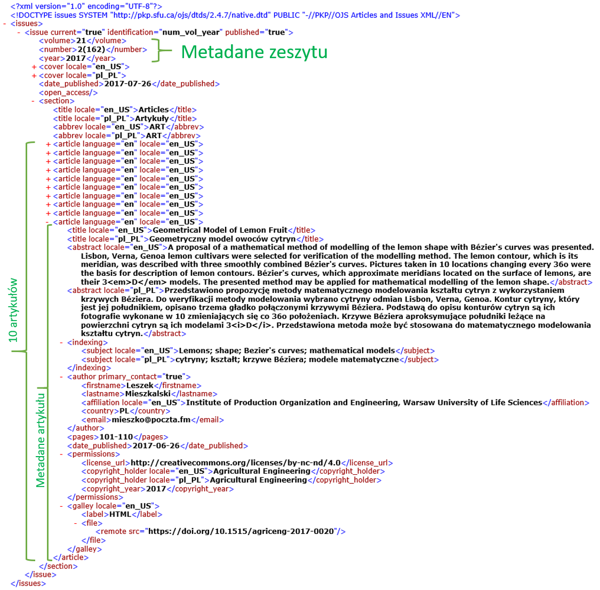
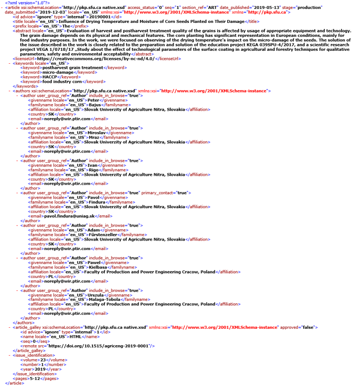

# Migracja danych _via_ XML

* Autor: _Krzysztof Molenda_
* Wersja: 1.0 (2019.12.11)

## Wprowadzenie

[_Open Journal System_](https://pkp.sfu.ca/ojs/) (w skrócie OJS) to system wspomagający prowadzenie czasopisma naukowego, realizując _workflow_: od zgłoszenia manuskryptu przez autorów, poprzez recenzje, opracowanie techniczne, aż po opublikowanie artykułu.

Oprogramowanie udostępniane jest za darmo i rozwijane na licencji GNU v.2.

Wielu wydawców korzysta z tego systemu. Do połowy 2018 r. obowiązywały wersje 2.x (zresztą nadal wspierane). Pod koniec 2018 r. pojawiła się - zupełnie zmieniona wersja OJS 3. Zmiany były fundamentalne, w wielu aspektach system został napisany ponownie, zmieniono nie tylko interfejs użytkownika, ale również architekturę bazy danych.

## Problem

Administratorzy opiekujący się systemem OJS 2.x napotkali poważne problemy przy migracji do OJS 3. Po wielu eksperymentach okazało się, że "najczystszym" sposobem jest zainstalowanie "świeżej" wersji OJS 3 i "ręczne" przenoszenie metadanych z wersji poprzedniej - na przykład za pomocą mechanizmów importu i eksportu _via_ pliki XML.

Przedstawiony poniżej problem jest uproszczeniem i tylko fragmentem tego skomplikowanego procesu migracji.

## Zadanie

Dany masz plik [`issue.xml`](issues.xml) zawierający wyeksportowane z OJS 2.x metadane jednego z zeszytów czasopisma [_Agricultural Engineering_](https://content.sciendo.com/view/journals/agriceng/agriceng-overview.xml) - konkretnie [vol. 21, issue 2](https://content.sciendo.com/view/journals/agriceng/21/2/agriceng.21.issue-2.xml).

Dany masz przykład struktury pliku XML [`2019-0001.xml`](2019-0001.xml), który może zostać poprawnie zaimportowany do wersji OJS 3.

Przykład pochodzi z innego zeszytu [vol. 23, issue 1](https://content.sciendo.com/view/journals/agriceng/23/1/article-p5.xml) i uwzględnia nową strukturę metadanych przedstawioną w formacie XML. Przykład opisuje metadane **pojedynczego artykułu**.

Twoim zadaniem jest napisanie w C# aplikacji, która

1. wczyta plik `issue.xml` zawierający metainformacje związane z konkretnym zeszytem (`n` artykułów) w formacie eksportu z OJS 2.x,
2. we wskazanym folderze utworzy `n` plików zawierających metadane wszystkich artykułów, w formacie importu XML akceptowalnym przez OJS 3,
3. przy realizacji zadania wzorujesz się na przykładowych plikach XML.

**Uwagi:**

* W plikach wynikowych **nie ma** metainformacji związanych z językiem polskim (elementy z atrybutem `locale="pl_PL"`).
* Nazwy plików wynikowych to końcowy fragment numeru [doi](https://pl.wikipedia.org/wiki/DOI_(identyfikator_cyfrowy)), odczytany z elementu `<remote src= ...>` dla danego artykułu. Na przykład dla
  `<remote src="https://doi.org/10.1515/agriceng-2019-0001"/>`
  nazwa pliku to `2019-0001.xml`.
* Pewne informacje w nowym formacie są "sztywne" (np. odwołania do schematów `xmlns`). Należy po prostu je tam wprowadzić.
* W nowym formacie nowy element `<id type="internal" advice="ignore">20190001</id>` bezpośrednio w `<article>` (nie `<article_galley>`): jego wartość jest sklejeniem dwóch ostatnich kodów `doi:`.
* Część elementów i atrybutów w nowym formacie, to te same, które są w starym, ale ze zmienioną nazwą i w innej lokalizacji drzewa XML.

## Cel ćwiczenia

Celem ćwiczenia jest - w oparciu o praktyczny problem - zapoznanie się z technikami przetwarzania dokumentów XML za pomocą bibliotek .NET, ze szczególnym uwzględnieniem _LINQ to XML_. 

* [LINQ to XML Overview (C#) @Microsoft](https://docs.microsoft.com/en-Us/dotnet/csharp/programming-guide/concepts/linq/linq-to-xml-overview)
* [Basic Queries (LINQ to XML) (C#) @Microsoft](https://docs.microsoft.com/en-Us/dotnet/csharp/programming-guide/concepts/linq/basic-queries-linq-to-xml)
* [Learning LINQ Made Easy (LINQ to XML): Tutorial 3 @C# Corner](https://www.c-sharpcorner.com/UploadFile/de41d6/learning-linq-made-easy-linq-to-xml-tutorial-3/)

**UWAGA:** nie rozwiązujemy zadania za pomocą transformacji XLST.

---

## Referencje

Aby rozwiązać podany problem, nie ma potrzeby odwoływania się do poniższych referencji. Podane zostały z kronikarskiego obowiązku.

* Fragment oficjalnej dokumentacji systemu OJS 3 omawiający import metadanych o artykułach i zeszytach za pomocą XML: <https://docs.pkp.sfu.ca/importing-exporting/en/#articles-and-issues-xml-plugin>. Dokumentacja ta, niestety zawiera drobne błędy (niezmienione opisy z wersji 2.x).
* Projekt [PKP-OJS na github](https://github.com/pkp/ojs).
* [native.xsd](https://raw.githubusercontent.com/pkp/ojs/master/plugins/importexport/native/native.xsd) - Schema describing native XML import/export elements specific to OJS.
